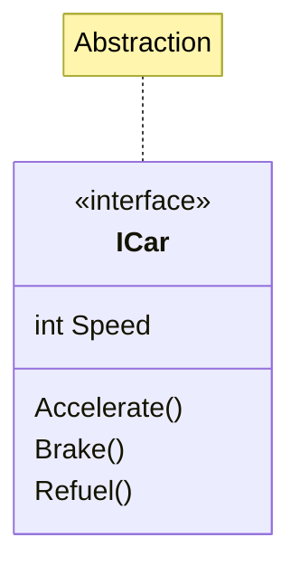
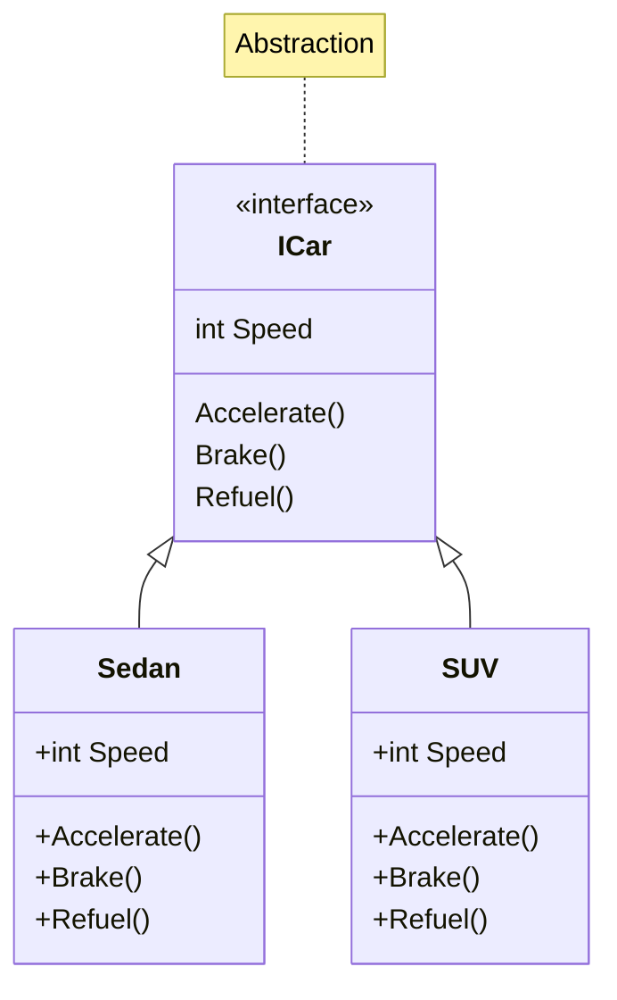
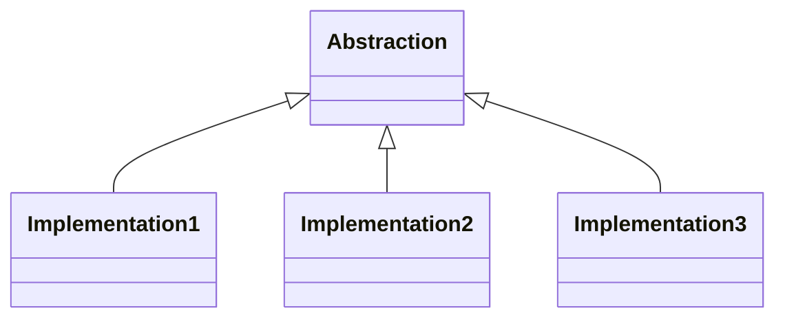

+++
date = '2025-02-20T19:09:36+05:30'
draft = false
title = 'Abstraction in C#'
tags = ['oops']
categories=['programming']
image = '/images/1_6CWERFGOQbJWr-R6wNi2oA.png'
+++

<!--  -->

📢 Updated and refinded at : 21-feb-2025

**Abstraction** allows you to focus on the relevant details of an object while ignoring unnecessary complexities.  
This is achieved by defining a simplified representation of an object that **hides the implementation details and exposes only the necessary features**.  
In practical terms, **abstraction is implemented through abstract classes and interfaces in languages like C#**.

**📺Other OOPs related articles :**

- [Encapsulation in C#](/posts/encapsulation-in-csharp/)
- [Polymorphism in C#](/posts/polymorphism-in-csharp/)
- [Inheritance in c#](/posts/inheritance-in-csharp/)

Let’s implement abstraction by using **interface**. In the real world projects, we use interfaces more often.



Or code representation:

```cs
public interface ICar
{
    int Speed { get; set; }

    void Accelerate();

    void Brake();

    void Refuel();

}
```

👉In this case, `ICar` is an `interface` with some features. A class, that implements this interface, will follow this blueprint. That class must have a property name `Speed` and the methods like `Accelerate(),Brake()` and `Refuel()`. These are the necessary details for any type of car, it does not matter if it is a sedan, SUV or a sports car. Every Car will have these features.

👉 So we are declaring the **necessary features** like `Speed`, `Accelarate()`,`Break()` and `Refule()` and **hiding unnecessary complexities** like `implementation details` of these features.

Abstraction is like looking at these things from a high level without worrying about specific details. For example, you don’t care about how the `Brake()` feature will work. You are saying that, hey there will be a `Break()` feature in the Car. How does `Break()` work? We don’t care. It will be taken care later. Which will be shown in this example.

We are creating a class `Sedan`, which is implementing `ICar` interface. In this class, we are defining the `Accelarate(),Brake() and Refuel()` feature according to the sedan cars.



C# implementation:

```cs
public class Sedan : ICar
{
    public int Speed { get; set; }

    public void Accelerate()
    {
        // Implementation for accelerating a sedan
    }

    public void Brake()
    {
        // Implementation for braking a sedan
    }

    public void Refuel()
    {
        // Implementation for refueling a sedan
    }

}
```

👉 Similarly, create other **classes** like `SUV`, `SportsCar` etc.

👉 That was all about abstraction you might have few doubts in mind, like why need to create an interface, then implement it in a class. We can directly create a class with all the needed features. If you have that doubt then move to the next section, otherwise you can skip it here.

---

## Why would I take an extra step to create the interface?

Now, you might be wondering that, why do we create an interface and implement it in a class. We can avoid the extra step of creating the interface and define all the methods in the class. As shown in the example below.

```cs
public class Sedan
{
    public int Speed { get; set; }

    public void Accelerate() {}

    public void Brake() {}

    public void Refuel() {}

}
```

Here we are not using any interface and still achieving the same result. Let’s see what are the benefits.

1.It enforces a contract to maintain the code consistency.

**2. 🔖Makes system extensible:** You can easily swap implementation which are implementing the same abstraction. If you need to add new types of cars in the future, you can easily create additional classes that implement the existing `ICar` interface. This extension doesn’t require changes to existing code that uses the interface.

**3. Testing and Mocking:** Interfaces make it easier to write unit tests and use mocking frameworks. When you do unit testing in C# using (MOQ or nsubstitute) will find the benefits of using interfaces.

## Summary

- Abstraction allows to focus on what is necessary while ignoring about the complexities like implementation details.
- In c# it is achieved through either `Abstract class` or `interface`.
- In simpler terms, **Abstraction**: interface or abstract class. **Implementation**: class that is derived or implemented from abstraction.



- Its benefits:
  - You can define things in the higher level without worrying about the implementation
  - Enforces a contract, which leads to consitency
  - Makes your system extensible. You can easily swap implementations which are implementing the same abstraction. If we take a look at above diagram, each implementations are swapable because they all are implemented from the same Abstraction.
  - Most of the mocking framework relies only on interfaces.

---

Originally posted by [Ravindra Devrani](https://medium.com/@ravindradevrani) on [January 30, 2024](https://medium.com/p/c3d4c832942a). Updated and refinded at : 21-feb-2025.

[Canonical link](https://medium.com/@ravindradevrani/abstraction-in-c-c3d4c832942a)
