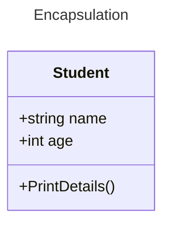
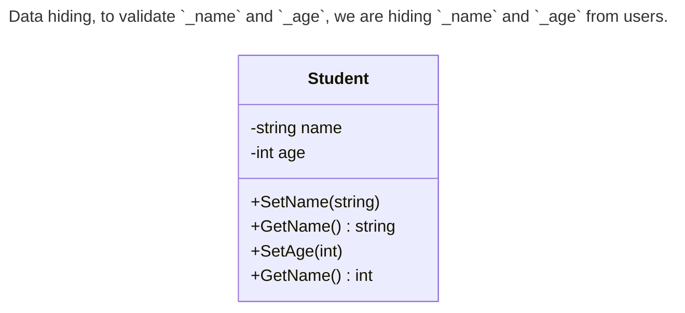

+++
date = '2025-02-20T19:41:25+05:30'
draft = false
title = 'Encapsulation in C#'
tags = ['oops']
categories=['programming']
image = '/images/csharp-encapsulation.png'
+++

<!--  -->

📢 Updated and refinded at : 21-feb-2025

**Bundling the data member and member function into a single unit** is called **encapsulation**. Remember the term **“capsule”**. We put all the medicine inside a wrapper and call it capsule. Similarly, wrap the data members and member functions together is called encapsulation.

Now we need to understand few terms.

- **Data members** : Attributes or properties (eg. name, age)
- **Member functions**: Methods (PrintDetails)

**👉 We wrap up the data members (_attributes or properties_) and member functions (_methods_) into a single unit (_class_).**

## 📺 Other OOPs Related articles

- [Abstraction in C#](/posts/abstraction-in-csharp/)
- [Polymorphism in C#](/posts/polymorphism-in-csharp/)
- [Inheritance in c#](/posts/inheritance-in-csharp/)

Let’s understand Encapsulation with an example.



```cs
public class Student
{
 public string name;
 public int age;
 public void PrintDetails()
 {
 Console.WriteLine($"Name: {name}, Age: {age}");
 }
}
```

👉 In this example, we are bundling the data members **(name, age)** and member functions **(PrintDetails)** into a single unit **(Student).**

Now we can use the **Student** class, by instantiating it.

```cs
public class Program
{
 static void Main()
 {
 Student student = new();
 student.name= "John Doe ";
 student.age = 12;
 student.PrintDetails();
 }
}
```

That is all you need to know about **encapsulation**. If you want to know more about it like it’s benefits, then you can read further, otherwise you can skip it.

---

## Benefits of Encapsulation

### 1. Data Hiding

**Encapsulation** helps you to **hide your sensitive data** from the end user.

#### Why data hiding? 😕

In the previous example, **Student** have two public attributes (**name** and **age**). These two attributes are not secure.

- **Name:** User can enter the name with any length. There is no restriction. What if he enters 2000 character long name.
- **Age:** What if user enters the age in negative numbers or 0.

So, you need some kind of restrictions in that data.



Let’s see how we can do it in c#.

```cs
public class Student
{
 private string? _name;
 private int _age;

    public void SetName(string name)
    {
        if (!string.IsNullOrWhiteSpace(name) && name.Length <= 30)
        {
            _name = name;
        }
        else throw new Exception("Invalid Name.Name's length must between 0 and 31");
    }

    public string GetName()=> _name;

    public void SetAge(int age)
    {
        if (age>0)
        {
           _age=age;
        }
        else throw new Exception("Invalid Age.Age should be greater than 0");
    }

    public int GetAge() => _age;

}

public class Program
{
 static void Main()
 {
 Student student = new();
 student.SetName("John Doe");
 student.SetAge(10);
 Console.WriteLine($"Name: {student.GetName()}, Age: {student.GetAge()}");
 }
}
```

We declares the **name** and **age** as **private** and setting/getting them through the public methods.

👉 You can achieve same with **properties**. It is the modern approach of validating data.

```cs
public class Student
{
 private string name;
 private int age;

    public string Name
    {
        get => name;
        set
        {
            if (!string.IsNullOrWhiteSpace(value) && value.Length <= 30)
            {
                name = value;
            }

                else throw new Exception("Invalid Name.Name's length must between 0 and 31");
        }
    }

    public int Age
    {
        get => age;
        set
        {
            if (value > 0)
            {
                age = value;
            }
            else
                 throw new Exception("Invalid Age.Age should be greater than 0");
        }
    }

}
public class Program
{
 static void Main()
 {
 Student student = new();
 student.Name="John Doe";
 student.Age=12;
 Console.WriteLine($"Name: {student.Name}, Age: {student.Age}");
 }
}
```

### 2. Access modifiers

You can set the protection level for your properties and methods with access modifiers like private, protected, internal etc.

### 3. Read-only data

Some time you want the **readonly** data in your class.

```cs
public string MyProperty { get; }
```

## Summary

- Wrapping up data into a single unit is called encapsulation.
- Encapsulation helps to achieve `data hiding`, that helps us to set the validation rules for our data members or fields.
- Encapsulation also helps us to define readonly members.

---

Original post by [Ravindra Devrani](https://medium.com/@ravindradevrani) on [January 31, 2024](https://medium.com/@ravindradevrani/encapsulation-in-c-cd6d61aa2c3d). Updated and refinded at : 21-feb-2025.

[Canonical link](https://medium.com/@ravindradevrani/encapsulation-in-c-cd6d61aa2c3d)
