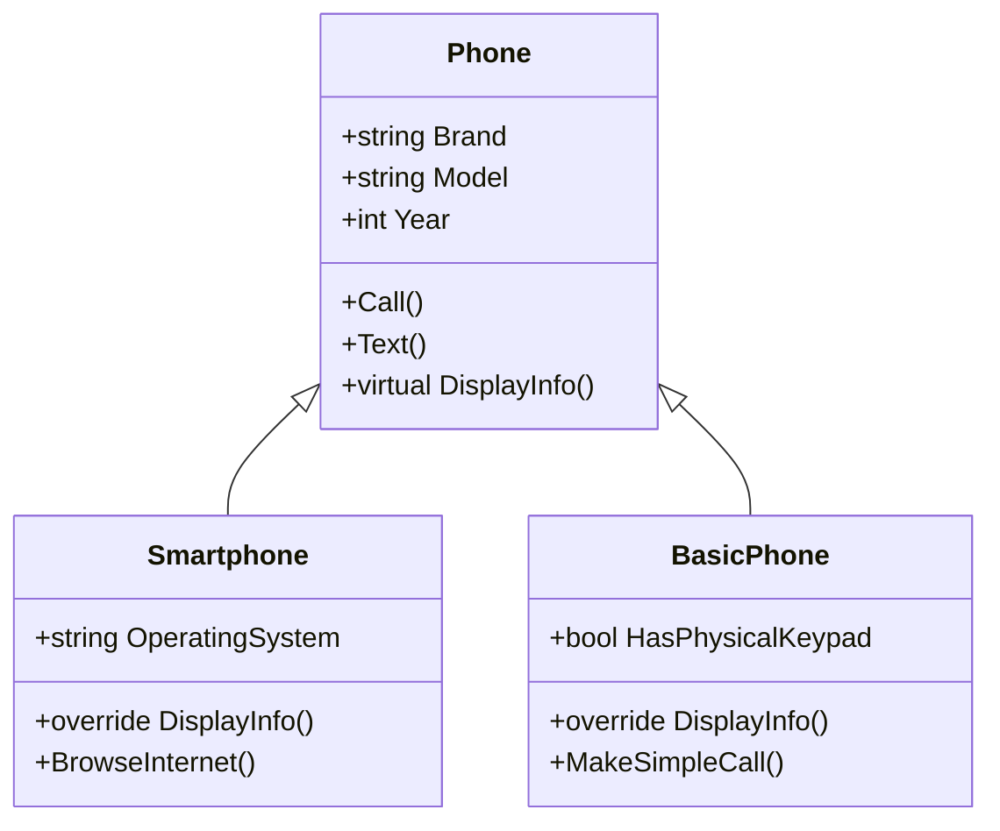
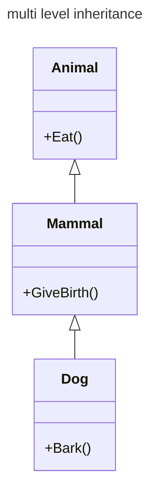

+++
date = '2025-02-20T19:49:18+05:30'
draft = false
title = 'Inheritance in C#'
tags = ['oops']
categories=['programming']
image = '/images/1_8OZ9YKcL2dZb_z79HSS0cw.png'
+++

<!--  -->

📢 Updated and refinded at : 21-feb-2025

Inheritance is a fundamental concept in OOPs that allows a class to inherit properties and behaviors of another class. We have two key terms are here **base class/superclass** and **derived class/subclass.**

- **Base class / super-class:** Whose members and functionality are inherited (Giver).
- **Derived class / sub-class:** Who is inheriting the members (Taker)

**📺Other oops concepts:**

- [Abstraction in C#](/posts/abstraction-in-csharp/)
- [Encapsulation in C#](/posts/encapsulation-in-csharp/)
- [Polymorphism in C#](/posts/polymorphism-in-csharp/)

**Syntax of inheritance:**

```cs
class BaseClass
{
 // content
}

class DerivedClass: BaseClass
{
 // content
}
```

Let’s understand it with example.



**👉Base class:** Phone

```cs
public class Phone
{
    public string Brand { get; set; }
    public string Model { get; set; }
    public int Year { get; set; }

    public void Call()
    {
        Console.WriteLine("Making a phone call.");
    }

    public void Text()
    {
        Console.WriteLine("Sending a text message.");
    }

    public virtual void DisplayInfo()
    {
        Console.WriteLine($"Brand: {Brand}");
        Console.WriteLine($"Model: {Model}");
        Console.WriteLine($"Year: {Year}");
    }

}
```

**👉Derived class:** Smart phone

```cs
public class Smartphone : Phone
{
    public string OperatingSystem { get; set; }

    public override void DisplayInfo()
    {
        base.DisplayInfo();
        Console.WriteLine($"Operating System: {OperatingSystem}");
    }

    public void BrowseInternet()
    {
        Console.WriteLine("Browsing the internet on the smartphone.");
    }

}
```

👉**Derived class:** Basic phone

```cs
public class BasicPhone : Phone
{
    public bool HasPhysicalKeypad { get; set; }

    public override void DisplayInfo()
    {
        base.DisplayInfo();
        Console.WriteLine($"Has Physical Keypad: {HasPhysicalKeypad}");
    }

    public void MakeSimpleCall()
    {
        Console.WriteLine("Making a call on the basic phone.");
    }

}
```

**Calling it in main method:**

```cs
Smartphone mySmartphone = new Smartphone
{
 Brand = "Samsung",
 Model = "Galaxy S21",
 Year = 2022,
 OperatingSystem = "Android"
};

BasicPhone myBasicPhone = new BasicPhone
{
 Brand = "Nokia",
 Model = "3310",
 Year = 2000,
 HasPhysicalKeypad = true
};

// Display phone information
Console.WriteLine("Smartphone Information:");
mySmartphone.DisplayInfo();
mySmartphone.Call();
mySmartphone.BrowseInternet();

Console.WriteLine("\\nBasic Phone Information:");
myBasicPhone.DisplayInfo();
myBasicPhone.Call();
myBasicPhone.MakeSimpleCall();
```

**😎Let’s Break it down:**

- Every phone have some common features like (Brand, Model, Year, Call, Text). If we have two classes **BasicPhone** and **SmartPhone**, we need to write these features in both classes, which leads to unnecessary code redundancy. It is beneficial to create one Base-Class (Phone) and put all the common functionality there(in Phone class). Both classes (**BasicPhone** and **SmartPhone**) will re-use the common f functionality by inheritance. Now **BasicPhone** and **SmartPhone** will not have any redundant code.
- `Phone` is a base class. `BasicPhone` and `SmartPhone` are derived classes.

- **Extending Functionality:** The subclass can extend or override the functionality of the superclass. It can add new methods or properties, or override existing ones to suit its specific needs. In the above example , derived classes are overriding the `DisplayInfo()` method.

## Commonly known inheritance

### Single inheritance

Previous example was single inheritance . `BasicPhone` class inherits the `Phone class`.

### Multilevel inheritance



`Animal` is inherited by `Mammal` and `Mammal` is inherited by `Dog`

```cs
// Base class
class Animal {
 public void Eat() {
 Console.WriteLine("Animal is eating.");
 }
}

// First derived class
class Mammal : Animal {
 public void GiveBirth() {
 Console.WriteLine("Mammal gives birth.");
 }
}

// Second derived class (inherits from Mammal)
class Dog : Mammal {
 public void Bark() {
 Console.WriteLine("Dog is barking.");
 }
}

class Program
{
 static void Main()
 {
 Dog myDog = new Dog();
 myDog.Eat(); // Inherited from Animal
 myDog.GiveBirth(); // Inherited from Mammal
 myDog.Bark(); // Method from Dog class
 }
}
```

### Multiple inheritance

**Eg.** `Class C` inherits both `Class A` and `Class B` (C:A,B)

⚠️Multiple inheritance is **not allowed** in c#. Why? Because of `diamond problem`.

**✏️Diamond Problem:** Multiple inheritance can lead to a situation known as the “diamond problem.” This occurs when a class inherits from two classes that have a common ancestor. If there are conflicting methods or members in the common ancestor, it becomes ambiguous for the derived class to determine which implementation to use. This can result in confusion and errors.

```cs
// Diamond problem example (not allowed in C#)
class A { public void DoSomething() {} }
class B : A { public void DoSomethingElse() {} }
class C : A { public void DoYetAnotherThing() {} }
class D : B, C { } // Ambiguity arises here
```

Pictorial representation


`Class B` inherits `class A`, which have `DoSomething()` method. `Class C` also inherits `class A`. If `D` inherits `B` and `C`, it will get two `DoSomething()` methods which is ambiguous. That’s why multiple inheritance is not allowed in c#.

**👏Solution for multiple inheritance (Interface-based Approach)**: C# provides a way to achieve some benefits of multiple inheritance through interfaces. Classes can implement multiple interfaces, allowing them to inherit method signatures from multiple sources without the ambiguity associated with multiple inheritance. Since interface does not contain any method definition, that’s why can’t be any ambiguity.

```cs
interface IDrawable { void Draw(); }
interface IResizable { void Resize(); }

class Shape : IDrawable, IResizable {
 public void Draw() {  ...  }
 public void Resize() {  ...  }
}
```

---

## Summary

- A class can access the features of another class called inheritance.
- Giver : Base Class or Super class
- Taker : Derived Class or Sub Class
- Multiple inheritance is not allowed in C#, because of diamond problem.
- Diamond problem :

```cs
Class A {MethodA()}
Class B: A {MethodB()}
Class C: A {MethodC()}
Class D: B,C {}
// D have multiple methods with name `MethodA`, which leads to ambiguity.
```

- To address the issue of diamond problem, we need to use interface. Since interfaces does not have method defintion, there won't be any ambiguity.

Original post by [Ravindra Devrani](https://medium.com/@ravindradevrani) on [February 2, 2024](https://medium.com/p/08327a9efee5). Updated and refinded at : 21-feb-2025

[Canonical link](https://medium.com/@ravindradevrani/inheritance-in-c-08327a9efee5)
