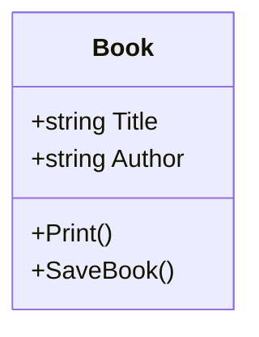

+++
date = '2025-02-22T19:03:39+05:30'
draft = false
title = 'Single Responsibility Principle (SRP)'
tags = ['design-patterns','SOLID']
category = ['programming']
+++


The `Single Responsibility Principle (SRP)` is a cornerstone of object-oriented design, closely associated with the `SOLID principles`. It emphasizes that **a class should have only one reason to change**, meaning it should have a single responsibility or purpose.

### What is SRP?

The principle asserts that **a class should do only one thing and do it very well**. This doesn’t imply that a class should have only one method or behavior, but rather that it should contain a cohesive set of behaviors related to a single responsibility.

Other SOLID principles

- [Single Responsibility Principle](/posts/single-responsibility-principle/)
- [Open Closed Principle](/posts/open-closed-principle/)
- [Liskov Substitution Problem](/posts/liskov-substitution-principle/)
- [Interface Segregation Principle](/posts/interface-segregation-principle/)
- [Dependency Inversion Principle](/posts/dependency-inversion-principle/)

Let’s explore SRP with an example.

### Code without SRP



It is the code representation in c#:

```cs
public class Book
{
    public string Title { get; }
    public string Author { get; }
    public Book(string title, string author)
    {
        Title = title;
        Author = author;
    }
    public void Print()
    {
        Console.WriteLine($"Printing Book: {Title} by {Author}");
    }
    public void SaveBook(string filePath)
    {
        Console.WriteLine("Saving book to file: " + filePath);
    }
}
```

### Analyzing the Code

Does the `Book` class adhere to the `SRP`? Let's break down its responsibilities:

- **Representing Book Data:** Properties like `Title` and `Author`.
- **Managing Book Data:** The `SaveBook` method.
- **Printing Book Details:** The `Print` method.

Clearly, the `Book` class handles multiple responsibilities.

### Problems with Multiple Responsibilities

> 📢 Change is the only constant in the software.

You might wonder, what’s the harm in having multiple responsibilities in a single class? Here are some potential issues:

**1. Changing printing format:**  
Suppose a client requests a change in the print format. Modifying the `Print` method might inadvertently introduce bugs. Since the `Book` class is used in various parts of the software, these bugs could propagate, making the code difficult to maintain.

**2. Altering the SaveFile logic:**

If the saving logic changes (e.g., saving to a database instead of a file), updating the `SaveBook` method could similarly introduce bugs, affecting all parts of the software that use the `Book` class.

**3. Adding new functionality:**

Adding new features, like `exporting the book to a PDF`, increases the complexity of the `Book` class if it already handles multiple responsibilities.

**4. Testing complexity:**  
A class with multiple responsibilities can lead to complex unit tests, as tests must account for various concerns.

### Problems Of Not Following SRP

- **Harder to Maintain:** Changes to one responsibility might break others, making the code harder to maintain.
- **Understanding challenges**: New developers might struggle to understand a class with multiple responsibilities.
- **Reduced reusability**: If you need only the print functionality, you still have to include the save functionality, reducing reusability.
- **Poor Testability:** Testing becomes more difficult as tests need to cover multiple responsibilities.

### Refactored Example Following SRP

```mermaid
  ---
  title: Follows SRP
  ---

  classDiagram
    class Book{
        +string Title,
        +string Author
    }

    class BookPrinter{
        +Print(Book)
    }

    class BookRepository{
        +SaveBook(Book, string)
    }
```

We can separate the responsibilities into different classes.

- `BookClass` for managing book details.
- `BookPrinter` for printing the book.
- `BookRepository` for saving the book

Here is the refactored code.

```cs
// Book.cs
public class Book
{
    public string Title { get; set; }
    public string Author { get; set; }
}

// BookPrinter.cs
public class BookPrinter
{
    public void Print(Book book)
    {
        Console.WriteLine($"Printing Book: {book.Title} by {book.Author}");
    }
}

// BookRepository.cs
public class BookRepository
{
    public void SaveBook(Book book, string filePath)
    {
        Console.WriteLine("Saving book to file: " + filePath);
    }
}
```

By separating these responsibilities, each class now has single reason to change:

- The `Book` class will change if the structure of book detail changes.
- The `BookPrinter` class will change if the printing logic changes.
- The `BookRepository` class will change if the saving logic changes.

This makes the code more maintainable, testable, and adheres to the Single Responsibility Principle.

[Canonical link](https://medium.com/@ravindradevrani/solid-principles-1-single-responsibility-principle-srp-e345a2257c77)
